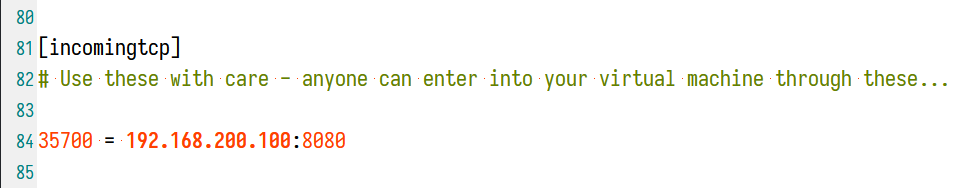

## 在 Vmware Player 中使用 EasyConnect

-   ### 网络代理

    虚拟机下载 [gost - GO Simple Tunnel](https://github.com/ginuerzh/gost)

    命令行执行 `gost.exe -L=:8080`

-   ### 端口映射

    编辑 `C:\ProgramData\VMware\vmnetnat.conf`

    在 `[incomingtcp]` 下新增一行

    ```properties
    # [主机端口号] = [虚拟机 IP]:[端口号]
    8888 = 192.168.200.123:8080
    ```

    

    即可在主机以 `127.0.0.1:8888` 访问虚拟机中 `:8080` 的服务
