## Vmware Player

1. 前置条件：安装好 `Vmware Player`，下载 `GRMCENVOL_WIN7_ENT_ZH-CN_PIP.iso`，`tools-windows.iso`，两个文件
2. 打开 Vmware Player，选择创建新虚拟机
3. 选择安装程序光盘映像文件，单击浏览，选择安装镜像 `GRMCENVOL_WIN7_ENT_ZH-CN_PIP.iso`，点击下一步
   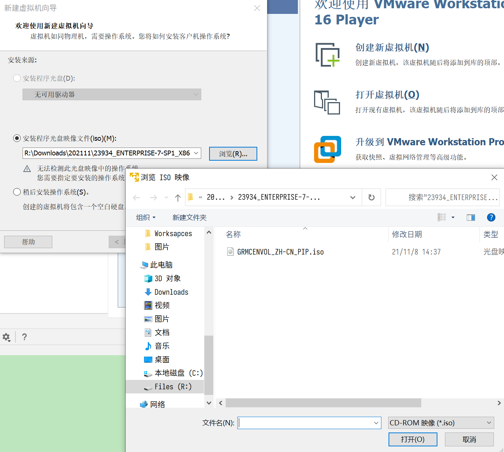
4. 选择 Windows 7 系统
   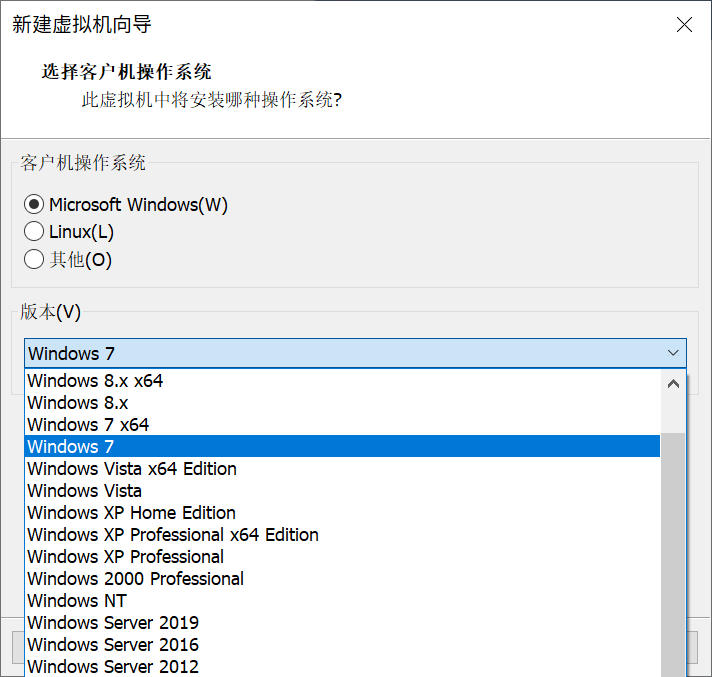
5. 选择虚拟机放置位置（新建一个文件夹）
   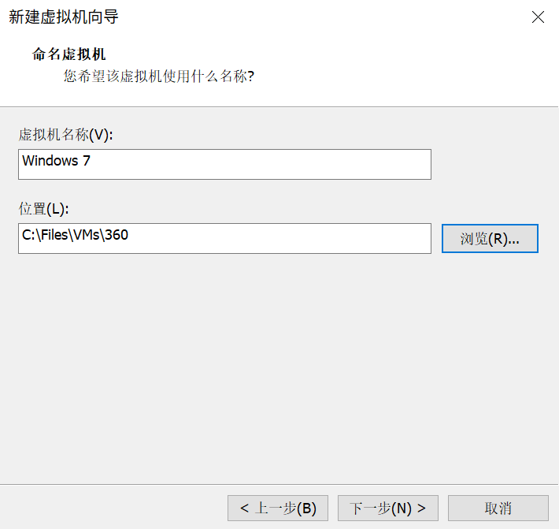
6. 磁盘大小分配 `10G`，选择存储为单个文件
   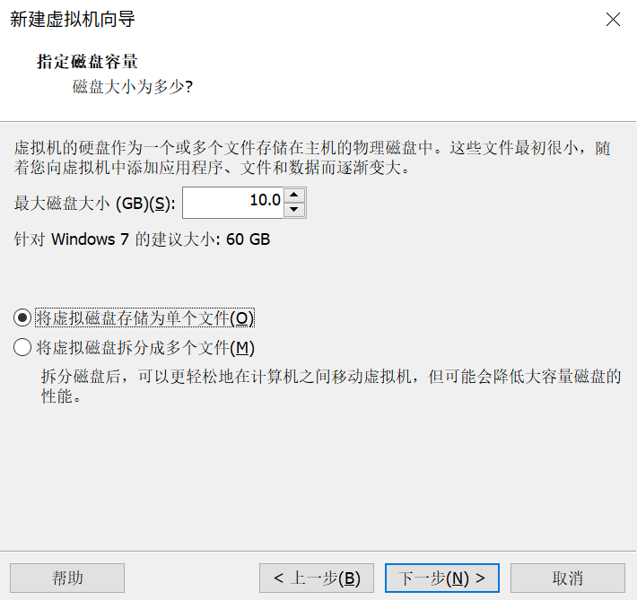
7. 点击自定义硬件，内存分配 `1G`，处理器 `1`，网络 `NAT`，CD/DVD 确认是刚才选择的 `GRMCENVOL_WIN7_ENT_ZH-CN_PIP.iso`，其他默认，显示器设置如图，配置完成后点击关闭、完成
   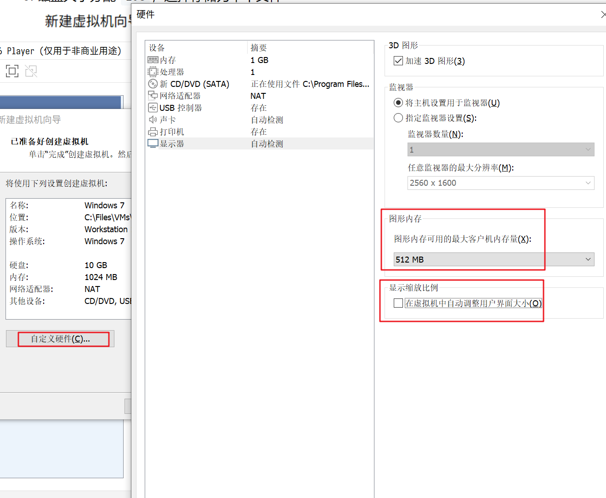
   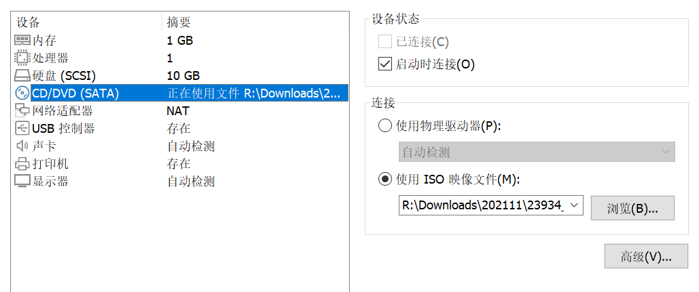
8. 选择刚才创建的虚拟机，点击播放虚拟机
   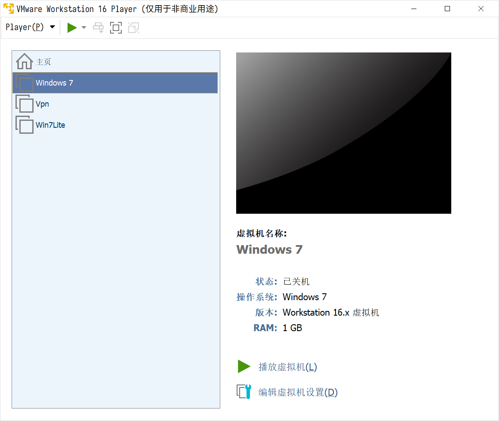
9. 开始安装系统，点击下一步、现在安装、我接受许可下一步
   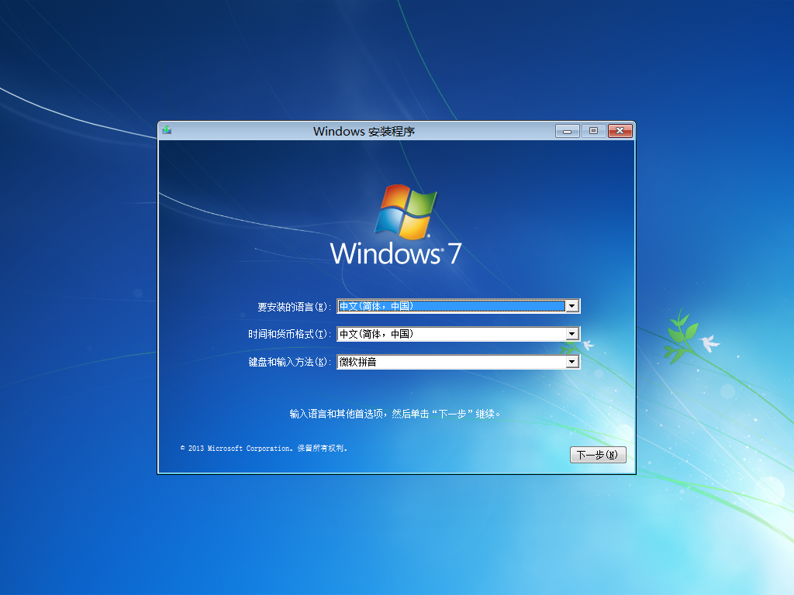
10. 选择自定义安装
    
11. 选中未分配的空间，点击下一步
    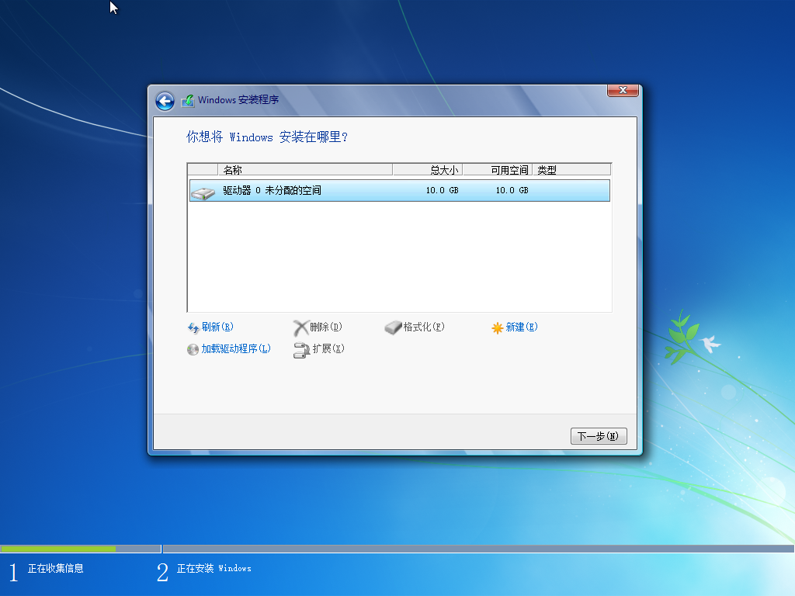
12. 正在安装系统，等待重启
    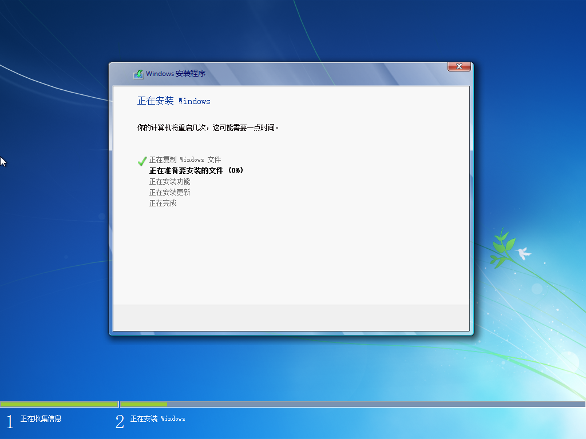
13. 安装完成进入系统，随意输入用户名，下一步，不需要密码
    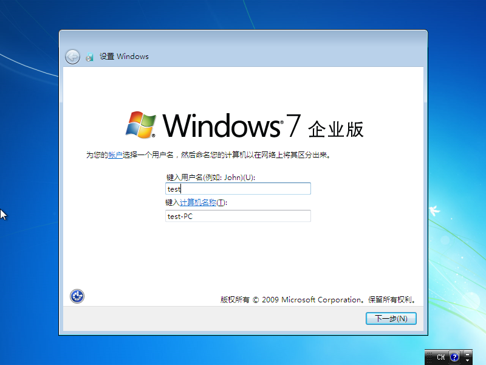
14. 以后询问我，然后下一步、家庭网络；进入系统
    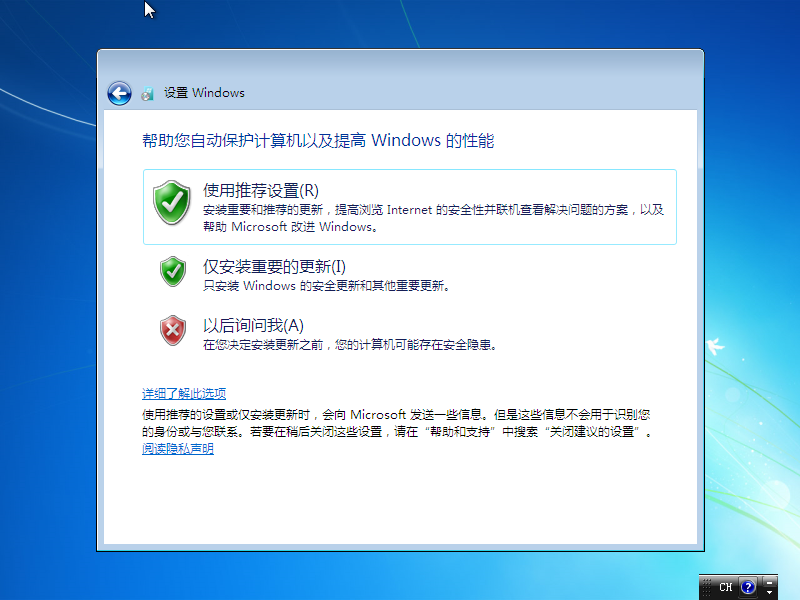
15. 打开虚拟机设置、选择 CD/DVD，浏览选择 `tools-windows.iso`
    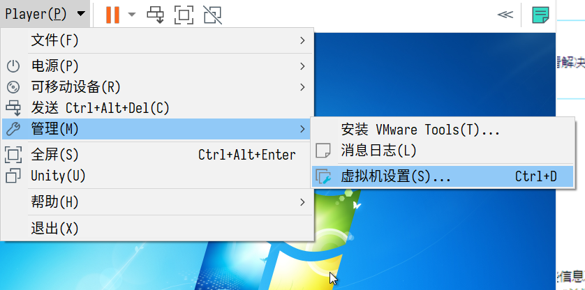
    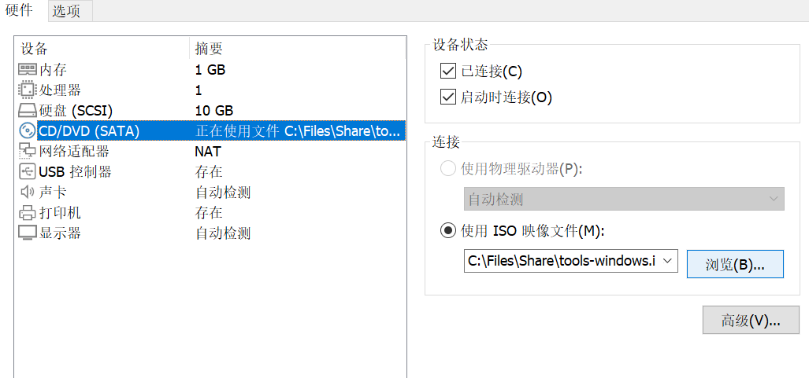
16. 打开虚拟机的文件管理，双击 DVD 驱动器，开始安装 `VMWare Tools`
    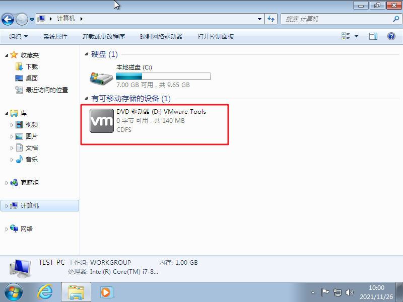
17. 一路全部下一步，安装完成，重启系统
18. 重启之后就可以往里拖文件，安装软件了
